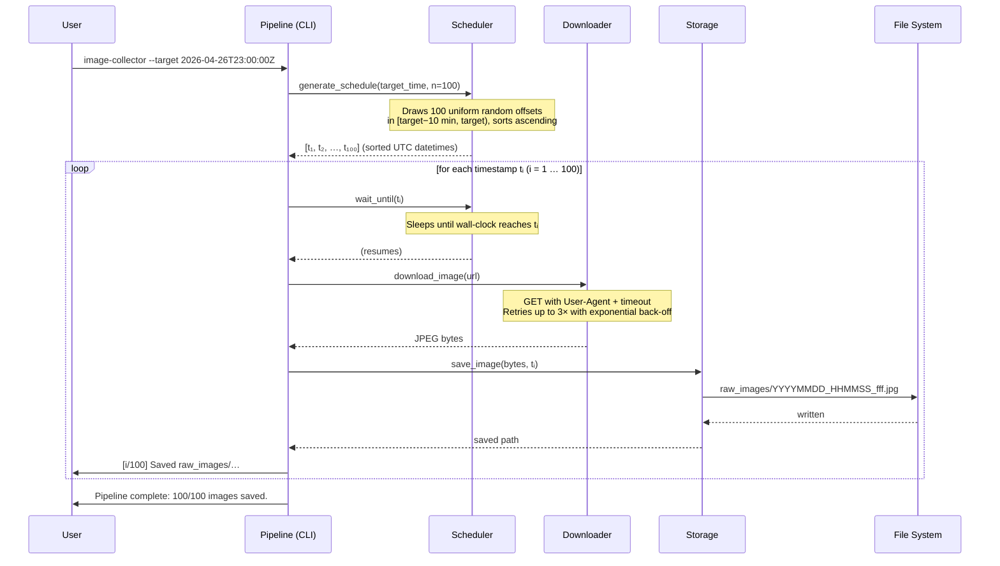

# Architecture

## Overview

The pipeline accepts a single **future target time** from the CLI and saves
100 face images downloaded from `https://thispersondoesnotexist.com/` to
`raw_images/`.  All 100 downloads are spread randomly across the
**10-minute window immediately before** the target time; each image file is
named using the UTC millisecond timestamp at which it was downloaded.

The system is intentionally synchronous and free of external state so it is
easy to reason about, test, and extend.

---

## Sequence Diagram



---

## Component Responsibilities

| Module | Responsibility |
|---|---|
| `pipeline.py` | CLI entry point; parses arguments, validates target time, orchestrates the loop |
| `scheduler.py` | Generates the random download schedule; provides a precision-sleep helper |
| `downloader.py` | Fetches a JPEG from the source URL; retries on transient HTTP / network errors |
| `storage.py` | Converts a UTC datetime to a millisecond-precision filename; writes bytes to disk |

---

## Data Flow

```
CLI args
    │
    ▼
pipeline.main()
    │  parse & validate --target
    │
    ▼
scheduler.generate_schedule()
    │  100 random UTC timestamps in [target−10min, target)
    │
    ▼
  for each timestamp tᵢ:
    │
    ├─► scheduler.wait_until(tᵢ)   ── blocks until wall clock = tᵢ
    │
    ├─► downloader.download_image() ── HTTP GET → bytes
    │
    └─► storage.save_image()        ── bytes → raw_images/YYYYMMDD_HHMMSS_fff.jpg
```

---

## Key Design Decisions

**No asyncio** — The pipeline is I/O-bound but not latency-sensitive enough to
justify async complexity.  A synchronous design is easier to follow, test, and
debug.

**Exact sleep durations** — `wait_until` calculates a single precise
`time.sleep(delay)` rather than polling in a tight loop, keeping CPU usage
near zero during the wait.

**Millisecond filenames as the only identity** — Images are ephemeral training
data; using the capture timestamp as the sole identifier makes the dataset
self-documenting and avoids collision without a separate registry.

**Retry with exponential back-off** — The source URL is a live website;
transient failures are expected.  Three attempts with base back-off of 1 s
(1 s, 2 s, 4 s) balance resilience against total pipeline delay.
